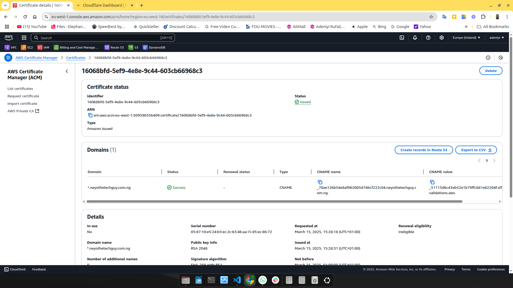
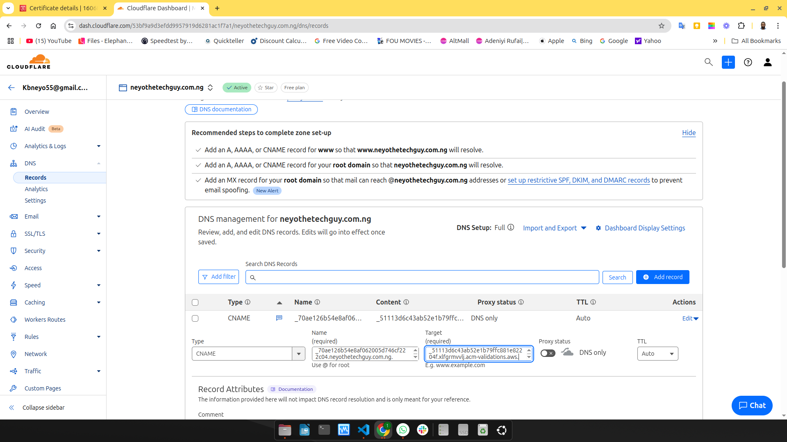
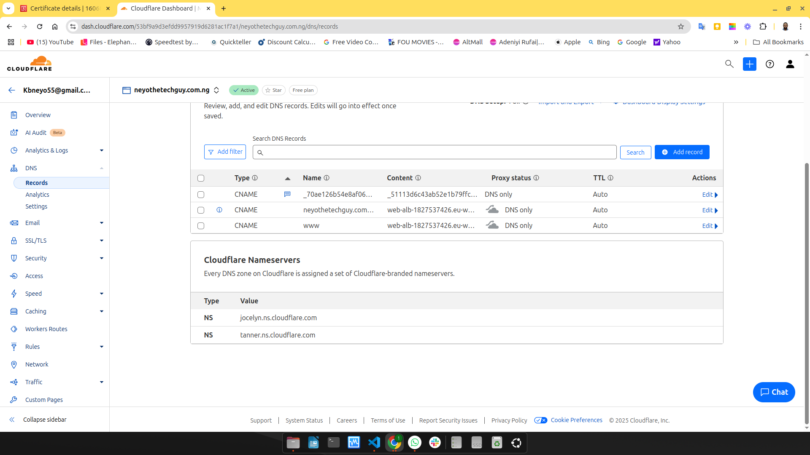
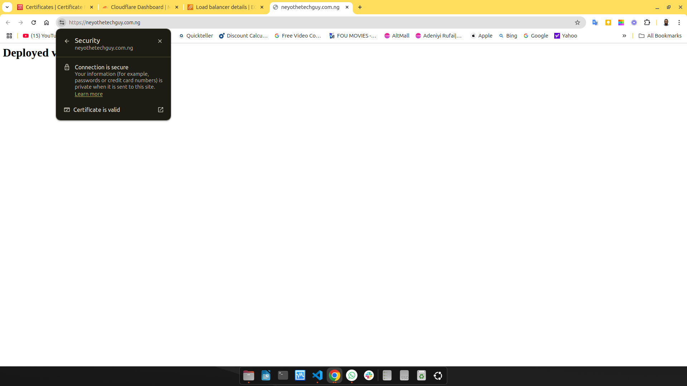

# step-by-step guide on how to request an SSL/TLS certificate in **AWS Certificate Manager (ACM)** for your domain, **neyothetechguy.com.ng**, and validate it using **Cloudflare DNS** or your domain `DNS` manager.

---

## **Step 1: Log in to AWS Console**
1. Go to the **AWS Management Console**: [AWS Console](https://aws.amazon.com/console/)
2. In the search bar, type **Certificate Manager** and click on **AWS Certificate Manager (ACM)**.

---

## **2: Request a Public Certificate**
1. Click **Request a certificate**.
2. Select **Request a public certificate** → Click **Next**.

---

## **Step 3: Enter Your Fully Qualified Domain Name (FQDN)**
- In the **Domain names** section, enter:
  - `neyothetechguy.com.ng` (for the main domain)
  - `*.neyothetechguy.com.ng` (for wildcard SSL, if you need subdomains like `www.neyothetechguy.com.ng`, `app.neyothetechguy.com.ng`).
- Click **Next**.

---

## **Step 4: Choose Validation Method**
- Select **DNS validation (Recommended)** because your DNS is managed by **Cloudflare**.
- Click **Next**.

---

## **Step 5: Add Tags (Optional)**
- If you want to organize your AWS resources, you can **Add Tags** (e.g., `Key: Project`, `Value: Website`).
- Click **Review**.

---
444444Step 6: Submit the Request**
- Click **Confirm and request**.

At this point, AWS will generate a **CNAME record** for DNS validation.
Also an ARN would be generated, copy the `acm arn` to your alb.tf before apply the setup.

---

## **Step 7: Validate the Domain in Cloudflare DNS**
Since my domain uses **Cloudflare as DNS**, i need to add the **CNAME record** provided by AWS.

1. Open a new tab and go to **Cloudflare**: [Cloudflare Dashboard](https://dash.cloudflare.com/)
2. Select your domain **neyothetechguy.com.ng**.
3. Click **DNS** from the left menu.
4. Click **Add record** and enter:
   - **Type:** `CNAME`
   - **Name:** (Copy the value from AWS ACM CNAME name) → Usually something like `_abc123.neyothetechguy.com.ng`
   - **Target:** (Copy the value from AWS ACM CNAME value) → A long string ending in `.amazontrust.com`
   - **TTL:** Auto
   - **Proxy status:** **Disable Proxy (Set to DNS Only)** ⚠️ (Very Important)



1. Click **Save**.



Your DNS record is now added!

---

## **Step 8: Wait for AWS Validation**
- AWS will automatically check the **CNAME record**.
- It may take **a few minutes to a few hours** to validate.
- You can **refresh the ACM page** to see if the certificate status changes from **Pending validation** to **Issued**.

---

## **Step 9: Use Your Certificate in AWS Services**
Once the certificate is issued, you can:
- Attach it to an **Application Load Balancer (ALB)** just like the one below in this terraform `alb` setup.
```hcl
# Load Balancer (ALB)
resource "aws_lb" "web_alb" {
  depends_on = [aws_security_group.web_sg]
  name               = "web-alb"
  internal           = false
  load_balancer_type = "application"
  security_groups    = [aws_security_group.web_sg.id]
  subnets            = [aws_subnet.web_subnet_a.id, aws_subnet.web_subnet_b.id]

  enable_deletion_protection = false
}

# Load Balancer Target Group
resource "aws_lb_target_group" "web_tg" {
  name     = "web-tg"
  port     = 80
  protocol = "HTTP"
  vpc_id   = aws_vpc.main.id

  health_check {
    path                = "/"
    interval            = 30
    timeout             = 5
    healthy_threshold   = 2
    unhealthy_threshold = 2
    matcher             = "200"
  }
}

# Redirect HTTP to HTTPS (Listener on Port 80)
resource "aws_lb_listener" "http" {
  load_balancer_arn = aws_lb.web_alb.arn
  port              = "80"
  protocol          = "HTTP"

  default_action {
    type = "redirect"
    redirect {
      port        = "443"
      protocol    = "HTTPS"
      status_code = "HTTP_301"
    }
  }
}

# HTTPS Listener on Port 443 using the ISSUED ACM Certificate
resource "aws_lb_listener" "https" {
  load_balancer_arn = aws_lb.web_alb.arn
  port              = "443"
  protocol          = "HTTPS"
  ssl_policy        = "ELBSecurityPolicy-2016-08"
  certificate_arn   = "arn:aws:acm:eu-west-1:509590356409:certificate/aae858cd-652d-46dd-bbcf-7541e9b2f355"

  default_action {
    type             = "forward"
    target_group_arn = aws_lb_target_group.web_tg.arn
  }
}

# Attach EC2 Instances to Target Group
resource "aws_lb_target_group_attachment" "web" {
  target_group_arn = aws_lb_target_group.web_tg.arn
  target_id        = aws_instance.web.id
  port             = 80
}
```
- you can use it for **CloudFront, API Gateway, or other AWS services**.

---

## **Additional Tips**
- If validation takes too long, double-check:
  - The **CNAME record is correctly added in Cloudflare**.
  - The **Proxy status is set to "DNS Only" (not Proxied)** in Cloudflare.
- If you use **Route 53** as DNS instead of Cloudflare, you can add the CNAME directly in **Route 53**.

---

🔹 **That’s it!** You have successfully requested and validated an SSL certificate on AWS ACM with Cloudflare DNS.


